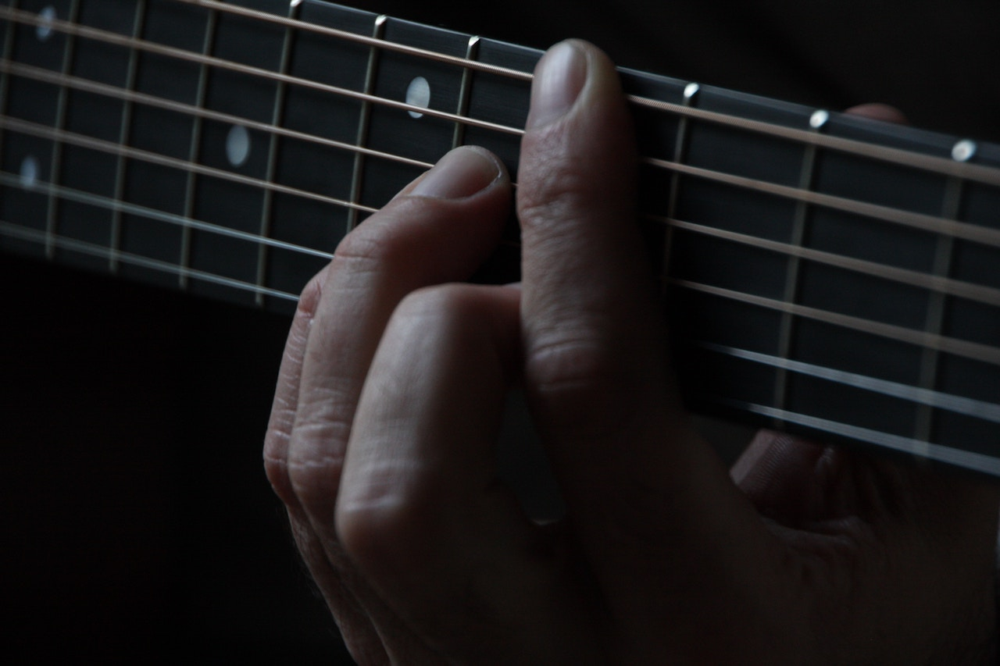

I always wanted to learn how to play guitar, but can never keep on practicing for more than 2 months. Recently, I've made up my mind that I'm going to take it seriously. But firstly, I have to figure out why I gave up, what my problems were in learning guitar and what I was struggle with. If I can't solve these problems, I might give up again. And these problems might happen to many other guitar beginners, my solution could be a solution for them.

##1. Feeling lost? Lack of a "big picture" in the world of guitar?

We all start with some basic chords, some simple strumming patterns and some easy songs that we like. But after several chords, patterns and songs, I felt like running in a hamster wheel, don't know where I was heading to or even where I was. So do I just keep remembering more chords and songs? What about the songs in which I know all the chords? Does this make me a better guitar player?  Am I moving forward or circling at the same place?

**Is there a road map for a beginner?**

So that we know how many common chords we should remember, how many common strumming patterns and techniques we should learn and easily keep track of our progress. I still remember in the movie *The Curious Case of Benjamin Button*, the lady who fails swimming across the English channel says that she probably won't have given up if she knew how far away she was from the shore. The idea is similar here. People might say there is no ending in learning guitar, but we can set milestones for every stages. And we can set branches at a certain stage: if you want to play blue music, go with this path; if you want to play finger style, go with that path. It's like the skill tree in a RPG game, you always know where you are at and what's next. The world of guitar is huge, it will be great if there is a map for beginners, which at least guides them to a stage that they can explore by themselves.

As I said, I'm just a beginner. I don't know how to come up with a map or the big picture of the guitar world. So I will try to create one while learning.

##2. Daily guitar practice routine and a practice plan

Another thing I need is a plan. I'm going to plan my daily practice for the next week in the weekend, so that I know what exactly to practice everyday and I don't need spend time on searching what to learn. During the weekend, I'm going to take a rest from practicing and think/research about what I need to learn the next week.

Daily practice will be divided into 4 parts:

1. Warm up.

2. Revision: what I learned yesterday, etc.

3. The new technique: could be new chords, strumming patterns and so on.

4. A song with the new technique: for example, if I'm trying to learn some new chords, I should find a song contains those chords to practice.

It usually takes more than one day to learn some new techniques and songs, so they might last for the whole week, but with different focuses, for example, I will work on the intro of the song on Monday, the verse on Tuesday, the chorus on Wednesday, etc.

So during the weekday, I don't need to worry about anything, just practice.

##3. Need some guitar buddies to practice together.

We human are social animals. It's always an good idea to have somebody by your side, to practice together, to discuss what we learned, to encourage each other, and also to create peer pressure so that we don't give up easily. We can also discuss about  the map and the weekly planning.

If you are interested in anything I said above, feel free to [contact me](/contact).