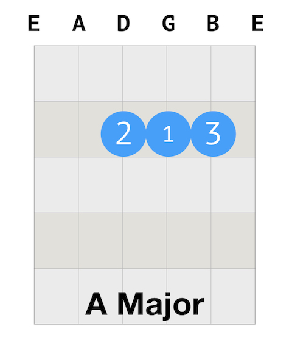

##Daily Guitar Practice 1: A, D, E Chords

Today's focus is **A chord**, **D chord**, and **E chord**. Here is the practice plan.

1. Warn up
   * Finger stretch.
   * Left hand: walking the notes; right hand: picking the notes.

2. Focus of the day: A, D, E Chords
   * Left hand: positions of fingers.
   * Right hand: all down strumming.

3. Song: I Walk The Line by Johnny Cash
   * Chords: E A E A D A E A
   * All down strum, 4 strums (1 bar) for each chord.

```
I Walk the Line
Johnny Cash
[Chorus]
A        E                            A
I keep a close watch on this heart of mine
A         E                      A
I keep my eyes wide open all the time.
A          D                         A
I keep the ends out for the tie that binds
A              E                A
Because you're mine, I walk the line
[Verse]
A        E                           A
I find it very, very easy to be true
A         E                      A
I find myself alone when each day is through
A          D                         A
Yes, I'll admit that I'm a fool for you
A              E                A
Because you're mine, I walk the line
A        E                            A
As sure as night is dark and day is light
A         E                      A
I keep you on my mind both day and night
A          D                         A
And happiness I've known proves that it's right
A              E                A
Because you're mine, I walk the line
[Chorus]
A        E                            A
You've got a way to keep me on your side
A         E                      A
You give me cause for love that I can't hide
A          D                         A
For you I know I'd even try to turn the tide
A              E                A
Because you're mine, I walk the line
```

Listen to the song:

`youtube:https://www.youtube.com/embed/KHF9itPLUo4`

Justin's lesson on this song:

`youtube:https://www.youtube.com/embed/qDXOa0DCnuA`

##How to play A major chord

The number on the blue circle indicates the finger: 1: index finger; 2: middle finger; 3: ring finger; 4: pinky.

Here is the guitar tab for A major chord. 



##How to play D major chord

Here is the guitar tab for D major chord.


##How to play E major chord

Here is the guitar tab for E major chord.


##Thoughts on today's practice

This is not my first day playing guitar and these chords are not new to me, but I try to stick to the plan. And as a second-time beginner, I do have some thoughts to share:

There is a focus on every stage. For a absolute beginner, your focus should be strengthening your fingers, especially your finger tips. They get hurt easily at this moment, but they heal in the next day or two. You can't play the perfect sound until your fingers are ready. So it's alright if your chord doesn't sound good for now. Also, you want to get used to the gestures of the chords. These are not normal poses that you would do in your daily life, thus you need to practice to familiarize your fingers. If your fingers hurt too much, you can't practice and it's more likely for you to give up. Therefore, at this moment, you don't have to press the strings too hard. When your finger tips hurt, try to move a bit, and continue to practice.

Remember at this stage, your goal is:

1. To strengthen your fingers.

2. To get used to the gestures of chords.

And not to be perfect.

But these are thoughts of a beginner, I could be wrong.