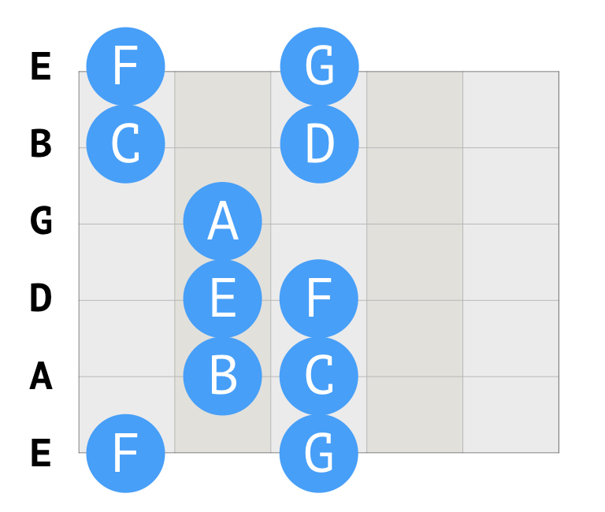
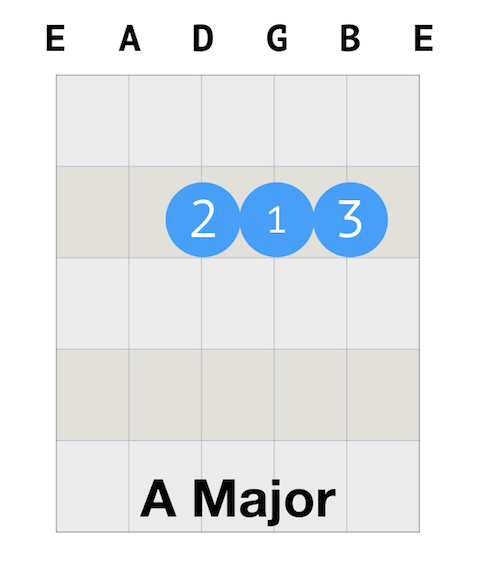
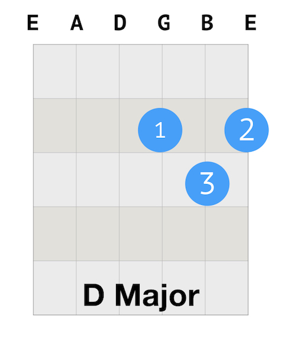
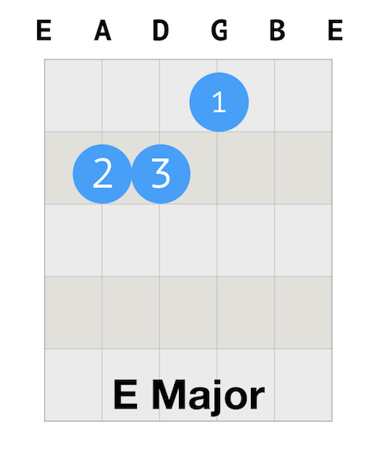

##Daily Guitar Practice 3 Happy Birthday

Today I will practice a really simple version of the song Happy birthday for ear training. And C scale is added to warm up after walking the notes.

A chord, D chord, and E chord are still on the list. Since these are my first set of chords, I'd like to spend more time on them. And the song I walk the line by Johnny Cash is a good practice for the chords.

1. Warm up
   * Finger stretch.
   * Walking the notes.
   * C Scale.

2. Revision: A, D, E Chords
   * Left hand: positions of fingers.
   * Right hand: all down strumming & base - down up.

3. Revision: I Walk The Line by Johnny Cash
   * Chords: E A E A D A E A
   * All down strum, 4 strums (1 bar) for each chord.

4. Ear training: Happy Birthday.

##The C Scale on guitar

Here is the C scale (part) on guitar.

##How to play Happy Birthday

G G A G C B

G G A G D C

G G G*E C B A
  
F F E C D C

Andy provides a very easy version of Happy Birthday. Why Happy Birthday? Why does this song has anything to do with the ear training? Check out [Justin's explanation](https://www.youtube.com/watch?v=JshGz3DIscU).

`youtube:https://www.youtube.com/embed/35pI-MrsdKo`

##How to play A major chord

The number on the blue circle indicates the finger: 1: index finger; 2: middle finger; 3: ring finger; 4: pinky.

Here is the guitar tab for A major chord. 

##How to play D major chord

Here is the guitar tab for D major chord.

##How to play E major chord

Here is the guitar tab for E major chord.

