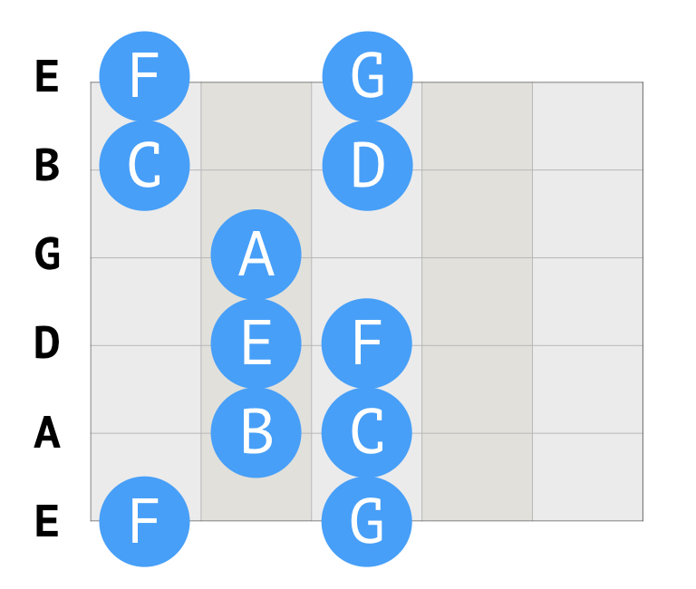
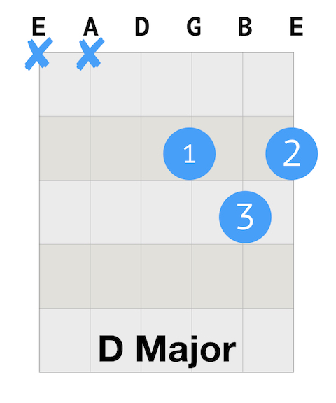

##Daily Guitar Practice 4

It's time to finish up with the A, D, and E chord. One minute change is added. As well as to play I Walk the Line along with Justin.

`youtube:https://www.youtube.com/embed/DvH461yJoMU`

1. Warm up
   * Finger stretch.
   * Walking the notes.
   * C Scale.
   * Happy Birthday

2. Revision: A, D, E Chords
   * Left hand: positions of fingers.
   * Right hand: all down strumming & base - down up.
   * One minute change.

3. Revision: I Walk The Line by Johnny Cash
   * Chords: E A E A D A E A
   * All down strum, 4 strums (1 bar) for each chord.

##The C Scale on guitar

Here is the C scale (part) on guitar.



##How to play Happy Birthday
```
G G A G C B

G G A G D C

G G G*E C B A

F F E C D C
```

##How to play A major chord

The number on the blue circle indicates the finger: 1: index finger; 2: middle finger; 3: ring finger; 4: pinky.

Here is the guitar tab for A major chord. 


##How to play D major chord

Here is the guitar tab for D major chord.



##How to play E major chord

Here is the guitar tab for E major chord.

