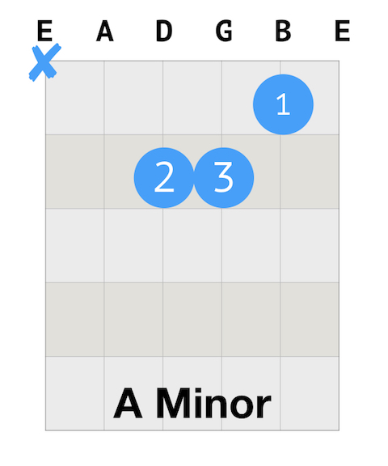
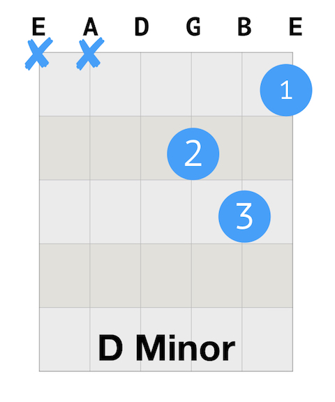

##Daily Guitar Practice 6 Sing a Note

For today's guitar practice, I will continue to practice Am, Dm, and Em chords. Also to add the singing a note practice and to pay more attention to the difference between chords so that I can tell one from another in the future.

1. Warm up
   * Finger stretch.
   * Walking the notes.
   * C Scale.
   * Happy Birthday
   * Sing a note.

2. Revision: A, D, E Chords
   * All down strumming & base - down up.

3. New chords: Am, Dm, Em chords.

4. Revision: I Walk The Line by Johnny Cash
   * Chords: E A E A D A E A
   * All down strumming & base - down up.

##How to play Happy Birthday
```
G G A G C B

G G A G D C

G G G*E C B A

F F E C D C
```

##How to play Am major chord

The number on the blue circle indicates the finger: 1: index finger; 2: middle finger; 3: ring finger; 4: pinky. And the blue X means you don't play that string(s).

Here is the guitar tab for A major chord. 



##How to play D major chord

Here is the guitar tab for D major chord.



##How to play E major chord

Here is the guitar tab for E major chord.

