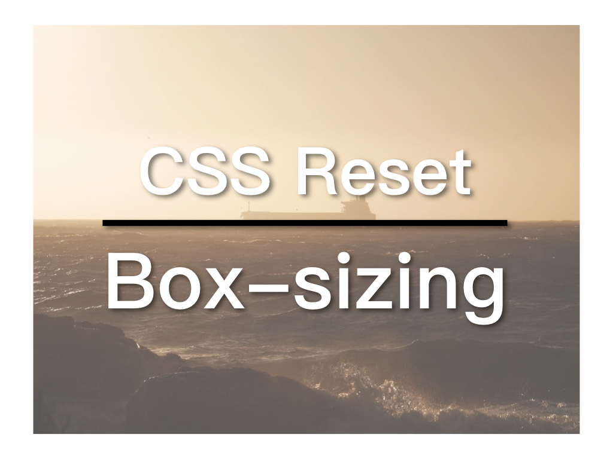

`youtube: https://www.youtube.com/embed/FkyFbo3w2v8`

## What is box-sizing？

The [Box Model](https://www.w3schools.com/css/css_boxmodel.asp) in CSS doesn't include padding and border to the width property. This is criticized by many developers. And `box-sizing` setting is here to rescue. By setting `box-sizing: border-box`, your CSS elements will include padding and border in the width, which is great and should be applied to every element. So how do we do that?

## Setting box-sizing

The easiest way to change box-size is as follow:

```
* {
  box-sizing: border-box;
}
```

By default it is set to **content-box**, for more information, please visit [W3Schools](https://www.w3schools.com/cssref/css3_pr_box-sizing.asp).

The problem of this approach is that box-sizing will not be inherited by children elements. So if you have a component that implements content-box within its scope, this setting will mess up the result. Here is an example provided by [Chris Coyier](https://css-tricks.com/inheriting-box-sizing-probably-slightly-better-best-practice/):

```
<div class="component"> <!-- I'm content-box -->
  <header> <!-- I'm border-box still -->
  </header>
</div>
```

Chris suggested a better way to do it:

```
html {
  box-sizing: border-box;
}
*,
*:before,
*:after {
  box-sizing: inherit;
}
```

In this way, *::before and *::after are included and the inherit problem is also solved.

However, there is a bug in Google Chrome: the `details` element doesn't inherit the box-sizing setting from its parent (some says it happens to `summary` too). Here is the demo of the bug: [codepen](https://codepen.io/andrewbelcher/pen/mwWZEM).

The bug was reported to [Google Chrome](https://bugs.chromium.org/p/chromium/issues/detail?id=589475) in 2016, but has been fixed yet. To address this problem, Bootstrap's reset: Reboot.css, chooses a different approach:

```
*,
*::before,
*::after {
  box-sizing: border-box;;
}
```

So they chose to ignore the inherit issue, which is reasonable, but I'm not sure if I like it. It is a tiny bug that's going to be fixed eventually, although we don't know when. But the fact that it hasn't got much attention from the Google Chrome team indicates that this is not a big issue. How often do you use `details`? What about `details` specifically required content-box? But the use of components in web design is getting more attentions and the idea of inheriting is the foundation of CSS. Therefore, I would rather go with Chris's approach and let the Google Chrome team worry about the bug.

## CSS Reset and Reboot.css by Bootstrap

While digging in box-sizing, I think about putting the setting into the CSS Reset. The most popular CSS Reset solutions are [Eric Meyer](https://meyerweb.com/eric/tools/css/reset/)'s reset and [Normalize.css](https://necolas.github.io/normalize.css/). Eric Meyer removes all the default styling, as a result, h1 looks exactly the same as h2 (no style at all). That means you needs to write styles for everything. And Normalize.css just resets all browsers to the same basic line. They try to be as less opinionated as possible. That's why Normalize.ccs doesn't set font family for you. And of course, box-sizing is not in Normalize.css.

Bootstrap 4 introduces its own CSS Reset solution: [Reboot.css](https://getbootstrap.com/docs/4.0/content/reboot/). It's based on Normalize.css with some opinionated settings. Since Bootstrap aims to suit most developer's needs, these settings make sense for most people. For example, Reboot.css advocates to use [System Font Stack](https://bitsofco.de/the-new-system-font-stack/).

However, I don't agree with everything in Reboot.css. Such as the box-sizing setting mentioned before. And I also prefer to set the font size of html to be 62.5%, which equals 10px, so that the base of rem is 10px, rather than 16px by default. And it will be much more easier to calculate your rem settings later:

```
html {
  font-size: 62.5%;
}
body {
  font-size: 1.6rem;
}
```

Furthermore, I'd to add Microsoft YaHei to the system font stack setting to enhance the support of Chinese.

```
$font-family-sans-serif: -apple-system, BlinkMacSystemFont, 'Microsoft YaHei', 'Segoe UI', Roboto,
  'Helvetica Neue', Arial, 'Noto Sans', sans-serif, 'Apple Color Emoji',
  'Segoe UI Emoji', 'Segoe UI Symbol', 'Noto Color Emoji' !default;
```

## Dawn.css: an opinionated CSS Reset

As a result, I create my own CSS Reset based on Reboot.css. This will be the start of all my new projects and I will keep updating it. And it's now available on GitHub: [Dawn.css](https://github.com/ZacharyChim/dawn.css).