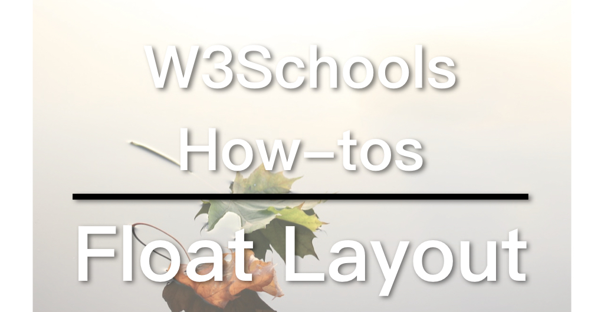

## W3Schools How To Series

[W3Schools] (https://www.w3schools.com) is a well-known web design/front-end development tutorial website, which  not only provides detailed tutorials on HTML, CSS, JavaScript, etc., but also can be used as a reference, as it explains almost everything in the web design field. You probably have already visited this website as a frontend developer, because it often appears on the first page of many search results that are related to web design. And its [How To] (https://www.w3schools.com/howto/default.asp) section is really useful. It provides tutorials on, for example, how to make a SlideShow (picture carousel), a Lightbox, a Parallax web page and so on. So I want to do a series of videos dedicated to these How-Tos.

## Video link

## Responsive web layout

In 2019, all new web pages will be Responsive. There are three main ways to implement a responsive layout:

1. Float
2. Flexbox
3. [CSS Grid] (https://zacklive.com/css-grid-intro/)

Of course, all three of them need to be used with [Media Query] (https://zacklive.com/media-query/).

Among them, CSS Grid is the latest. But as it's quite new, some worry about the browser support, which you can find more details on [Can I Use] (https://caniuse.com/#feat=css-grid). CSS Grid is designed for grid layouts. It will be the future for web layouts.

[CSS Grid Tutorial on W3Schools](https://www.w3schools.com/css/css_grid.asp)

Flexbox is also rather new, but the situtaion of the browser support is better than the CSS Grid. Basically, the mainstream of the frontend has now adopted the Flexbox. Bootstrap is a good example. But in fact, Flexbox is designed for one-dimensional layout (either a row or a column), and the layout of a webpage is usually two-dimensional (a grid). Flexbox is not the best choice, but because CSS Grid comes too late, Flexbox has been used to fulfill the task. Now many new The webpages and front-end frameworks use Flexbox.

[Flexbox Tutorial on W3Schools](https://www.w3schools.com/css/css3_flexbox.asp)

Float was originally designed to deal with problems such as text around image, and was later used for layout designs. The float layout has caused a variety of problems and is already being phased out. However, since it is very common in old websites, I believe that they will not disappear in a short time, thus it is necessary to understand how it works.

W3Schools offers tutorials for all the three methods. Today we will talk about the float.

## The Float  layout

To create a web layout with float, you can follow these 3 steps:

1. Float all the elements to the same direction (left or right).
2. Control the width of each element with a percentage.
3. Change the width of the element through Media Query to suit different screen sizes

[Float Example on W3Schools] (https://www.w3schools.com/css/tryit.asp?filename=trycss_website_layout_blog)

We should pay attention to two parts in this example. The first is the left and right columns, they were set to 75% and 25% wide respectively:

```
/* Left column */
.leftcolumn {
  Float: left;
  Width: 75%;
}

/* Right column */
.rightcolumn {
  Float: left;
  Width: 25%;
  Background-color: #f1f1f1;
  Padding-left: 20px;
}
```

The other is the Media Query, which sets the width of the two columns to 100% when the screen size is less than 800px to achieve Responsive Design:

```
@media screen and (max-width: 800px) {
  .leftcolumn, .rightcolumn {
    Width: 100%;
    Padding: 0;
  }
}
```

You have probably noticed that the navigation bar (.topnav) is in a similar situation. As the concept is quite the same, I'm not gonna elaborate it.

## Improvement: Mobile First

The idea of Mobile First means when designing a responsive layout, start from the mobile version and move up to the larger desktop version using the Media Query. The example here doesn't follow this concept, we can modify it to make it mobile first. And it is very easy, just reverse the content inside the Median Query and the corresponding content outside, don't forget to change the Media Query from **max-width** to **min-width**.

```
/* Left column */
.leftcolumn {
  Float: left;
  Width: 100%;
}

/* Right column */
.rightcolumn {
  Float: left;
  Width: 100%;
  Background-color: #f1f1f1;
  Padding: 0;
}
```

```
@media screen and (min-width: 800px) {
  .leftcolumn {
    Width: 75%;
  }
  .rightcolumn {
    Width: 25%;
    Padding-left: 20px;
  }
}
```

You can try to modify the .topnav yourself. Note that the width is auto if it is not specified. In addition, I found that the original example uses 400px as the breakpoint. After changing to min-width, it doesn't work. It needs to be changed to 500px. I am not sure about the reason, if you have any idea, feel free to comment below.

I opened a GitHub repository dedicated to the W3Schools How-tos series. You can find the Mobile First version here: [W3Schools GitHub] (https://github.com/ZacharyChim/W3Schools)