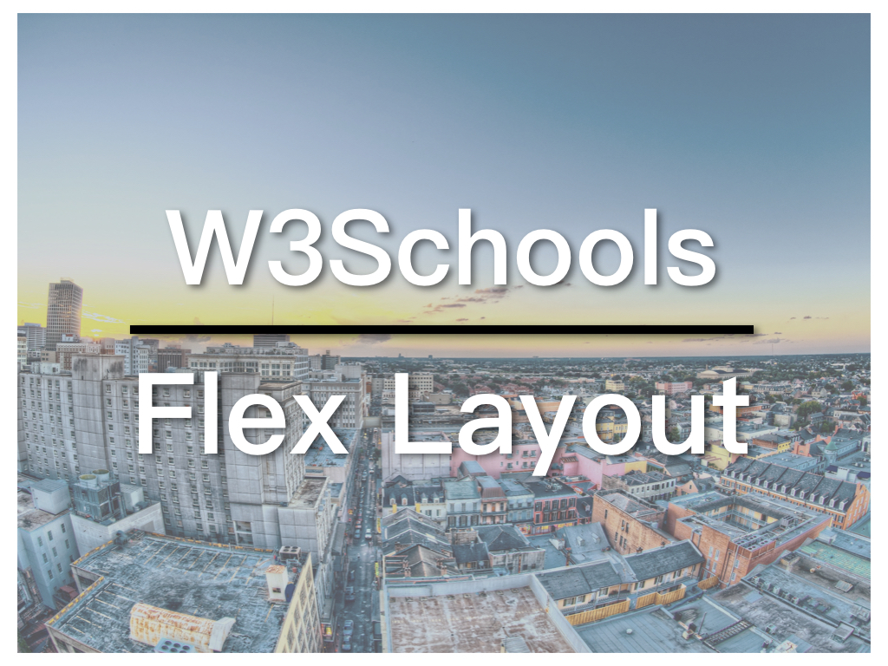

Today we are going to continue with our W3Schools series and learn how to create [responsive layout](https://zacklive.com/w3schools-web-layout/) with **Flexbox**. Using Flexbox for responsive design the a norm now at the beginning of 2019. If you are not familiar with Flexbox, you can check out the tutorial by W3Schools:

* [W3Schools Flexbox Tutorial](https://www.w3schools.com/css/css3_flexbox.asp)

* [Flexbox Responsive Layout Exxample](https://www.w3schools.com/howto/tryit.asp?filename=tryhow_make_a_website)

## Video link

## Flexbox Responsive Design

You can follow the following 3 steps to create responsive layout with Flexbox:

1. Display the container as flex and make it "wrap";
2. Set the *flex-basis* of each item in the Flex container to a percentage;
3. Change the container's flex direction to *column* (*row* by default) in **Media Query**.

In the W3Schools example, the Flex container is set as below:

```
.row {
  Display: flex;
  Flex-wrap: wrap;
}
```

The two columns in the container, a.k.a. the Flex items:

```
/* Sidebar/left column */
.side {
  Flex: 30%;
  Background-color: #f1f1f1;
  Padding: 20px;
}

/* Main column */
.main {
  Flex: 70%;
  Background-color: white;
  Padding: 20px;
}
```

Finally, the media query, the breakpoint is set at 700px:

```
@media screen and (max-width: 700px) {
  .row {
    Flex-direction: column;
  }
}
```

## Improvement: Mobile first

Again, as an exercise, we can make this example mobile first.

The Flex container:

```
.row {
  Display: flex;
  Flex-direction: column
}
```

The Flex items:

```
.side {
  Padding: 20px;
  Background-color: #f1f1f1;
}

/* Main column */
.main {
  Padding: 20px;
  Background-color: white;
}
```

And the media query:

```
@media screen and (min-width: 700px) {
  .row {
    Flex-direction: row;
  }
  .side {
    Flex: 30%;
  }
  .main {
    Flex: 70%;
  }
}
```

The code for the W3Schools series is on GitHub now: [W3Schools GitHub](https://github.com/ZacharyChim/W3Schools)

## W3Schools Teaching Series

W3Schools is a well-known web design/front-end development tutorial website, which not only provides detailed tutorials on HTML, CSS, JavaScript, etc., but also can be used as a reference, as it explains almost everything in the web design field. You probably have already visited this website as a frontend developer, because it often appears on the first page of many search results that are related to web design. And its How To section is really useful. It provides tutorials on, for example, how to make a SlideShow (picture carousel), a Lightbox, a Parallax web page and so on. So I want to do a series of videos dedicated to these How-Tos.

1. [Float Responsive Web Page Layout](https://atzack.com/w3schools-web-layout/)
2. [Flexbox Responsive Web Page Layout - W3Schools Video 02](https://atzack.com/w3schools-flex/)