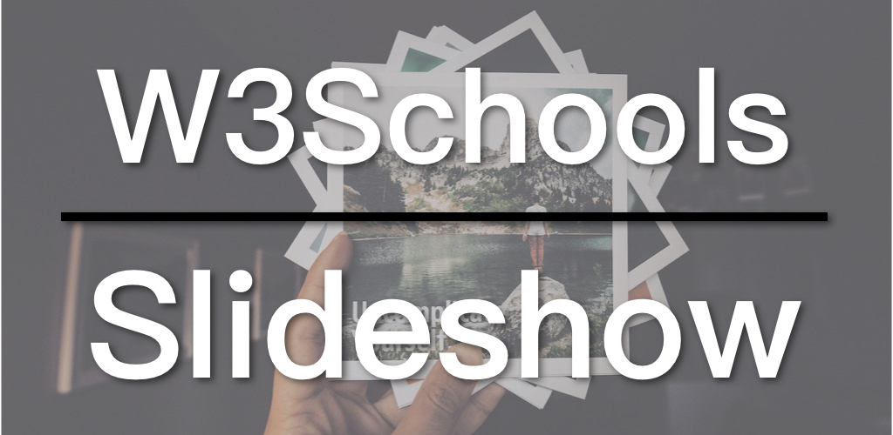

A slideshow is a common feature on a website. Today I'm going to take a look at the How to create a slideshow tutorial on W3Schools.

* [The W3Schools Slideshow tutorial](https://www.w3schools.com/howto/howto_js_slideshow.asp)
* [The Slideshow example by W3Schools](https://www.w3schools.com/howto/tryit.asp?filename=tryhow_js_slideshow)
* [The Simplified Slideshow](https://zacharychim.github.io/W3Schools/4_slideshow/)

`youtube:https://www.youtube.com/embed/rF875rUpCNg`

## How to Create a Slideshow

Basically, it takes 4 steps to create a basic slideshow.

1. Hide all the images in the slideshow (`display: none`);
2. Set the slide index to 1 in JavaScript and display the image according to the index;
3. Hide all the images before displaying any image.
4. When the left and right arrows are clicked, change the index (left-1, right+1), when the index exceeds the total number of images, reset it to 1, and vice versa, and then execute the `showSlides` function.

To highlight the logic of creating a slideshow, I simplified the slideshow example by the W3Schools, removing things like gradient effects, captions, and the dot navigation, leaving only the most basic images and left and right arrows.

Firstly, let's take look at the HTML. We have only a container, three pictures, and the left and right arrows:

```
<div class="slideshow-container">

  <div class="mySlides">
    
  </div>

  <div class="mySlides">
    
  </div>

  <div class="mySlides">
    
  </div>

  <a class="prev" onclick="changeSlides(-1)">&#10094;</a>
  <a class="next" onclick="changeSlides(1)">&#10095;</a>

</div>
```

Both arrows have the `onclick` events, corresponding to the `changeSlides` function, just with the image index offset.

Now, let's take a Look at the CSS:

```
.mySlides {
  display: none
}

/* Slideshow container */
.slideshow-container {
  max-width: 1000px;
  position: relative;
  margin: auto;
}

/* Next & previous buttons */
.prev, .next {
  position: absolute;
  top: 50%;
  width: auto;
  padding: 16px;
  margin-top: -22px;
  color: white;
  font-weight: bold;
  font-size: 18px;
}

/* Position the "next button" to the right */
.next {
  Right: 0;
}
```

First of all, we hide all the images.

In order to vertically center the two arrows, the position of the container was set to relative, so that it the container can be relative to the arrows inside ("An element with `position: absolute`; is positioned relative to the nearest positioned ancestor" --[W3Schools](https://www.w3schools.com/css/css_positioning.asp)). The `top` of the two arrows is set to 50%, so that the top of the arrow appears at the center of the picture, and then the arrows are moved up by the negative margin-top to make it in the middle of the height of the picture, so The negative value of the margin-top is about half of the height of the arrows. Finally, we move the right arrow to the right: `right: 0`;

And the most important part, the JavaScript:

```
var slideIndex = 1;
showSlides(slideIndex);

function changeSlides(n) {
  showSlides(slideIndex += n);
}

function showSlides(n) {
  var slides = document.getElementsByClassName("mySlides");
  
  if (n > slides.length) {slideIndex = 1}
  if (n < 1) {slideIndex = slides.length}
  
  for (var i = 0; i < slides.length; i++) {
    slides[i].style.display = "none";
  }

  slides[slideIndex-1].style.display = "block";
}
```

The `slideIndex` is set to 1 at the beginning, and the `showSlides` function is executed immediately to display the first picture.

The `changeSlides` function is to execute showSlides with a new image index, used by the arrows as the event function.

The key is the `showSlides` function. Firstly, we get all the images with `document.getElementsByClassName`, and then we check whether the image index is out of range: less than 1 or greater than the total number of images, if so, reset the index. Next, we use the `for` loop to hide all the images. Finally, the image is displayed according to the index.

This is the essence of the slideshow. There are more features in the original W3Schools. If you can understand the logic here, I believe you can  figure the rest easily.

The code for the W3Schools series is available on GitHub: [W3Schools GitHub](https://github.com/ZacharyChim/W3Schools)

## W3Schools How-To Videos

W3Schools is a well-known web design/front-end development tutorial website, which not only provides detailed tutorials on HTML, CSS, JavaScript, etc., but also can be used as a reference, as it explains almost everything in the web design field. You probably have already visited this website as a frontend developer, because it often appears on the first page of many search results that are related to web design. And its How To section is really useful. It provides tutorials on, for example, how to make a SlideShow (picture carousel), a Lightbox, a Parallax effect and so on. So I want to do a series of videos dedicated to these How-Tos.

1. [Float Responsive Web Page Layout](https://zacklive.com/w3schools-web-layout/)
2. [Flexbox Responsive Web Page Layout](https://zacklive.com/w3schools-flex/)
3. [CSS Grid Responsive Web Page Layout](https://zacklive.com/w3schools-grid/)
4. [How to implement the slideshow](https://zacklive.com/w3schools-slideshow/)