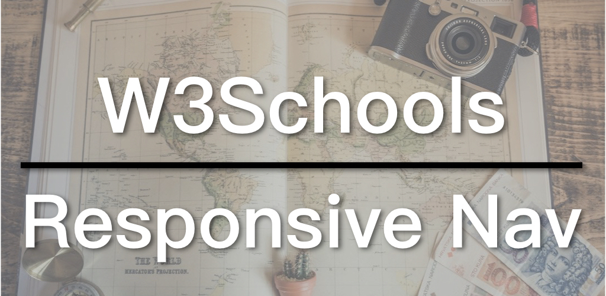

A navigation is a basic feature of a website and making it responsive is also a must nowadays. A common approach to create a responsive navigation is to use a navigation icon to represent the navigation and to show the whole menu only when the icon is clicked. Today we are following the tutorial from W3Schools to create a responsive navigation.

* [W3Schools Responsive Navigation Tutorial](https://www.w3schools.com/howto/howto_js_topnav_responsive.asp)
* [The Responsive Navigation Example](https://www.w3schools.com/howto/tryit.asp?filename=tryhow_js_topnav)

## Video

## A Responsive Navigation

Here are some key points for creating a responsive navigation:

1. Hide the navigation icon on a larger screen; display all the items of the navigation.
2. Hide most navigation items on a smaller screen, except for the Home link and the navigation icon, and only display other items when the icon is clicked.
3. When the icon is clicked, add the `responsive` css class to the navigation div in JavaScript, which will list the all navigation items vertically.

### The HTML of the Responsive Navigation

Here is the HTML of the responsive navigation:

```
<!DOCTYPE html>
<html>
<head>
<meta name="viewport" content="width=device-width, initial-scale=1">
<link rel="stylesheet" href="https://cdnjs.cloudflare.com/ajax/libs/font-awesome/4.7.0/css/font-awesome.min.css">
</head>
<body>

<div class="topnav" id="myTopnav">
  <a href="#home" class="active">Home</a>
  <a href="#news">News</a>
  <a href="#contact">Contact</a>
  <a href="#about">About</a>
  <a href="javascript:void(0);" class="icon" onclick="toggleNav()">
    <i class="fa fa-bars"></i>
  </a>
</div>

<div style="padding-left:16px">
  <h2>Responsive Topnav Example</h2>
  <p>Resize the browser window to see how it works.</p>
</div>

</body>
</html>
```

First of all, a css file of the [Font Awesome](https://fontawesome.com/) is loaded via the `<link>` tag in the `<head>` section, so that we can use the navigation icon. This will load all the font icons of the Font Awesome, and we use only one of them. A better way to do this is to use [Fontello](http://fontello.com/) to select the icons you want, generate your own icon set, and load it into your web pages.

The last link in the `topnav` is the navigation icon. `javascript:void(0);` is set for the reference of the link so that the default function of a link (jumping to another page or location) is disabled. An `icon` class is added and the `onclick` event is set to the `toggleNav` function, which we will talk about in the JavaScript section.

### The CSS of the Responsive Navigation

Let's take a look at the CSS:

```
body {
  margin: 0;
  font-family: Arial, Helvetica, sans-serif;
}

.topnav {
  overflow: hidden;
  background-color: #333;
}

.topnav a {
  float: left;
  display: block;
  color: #f2f2f2;
  text-align: center;
  padding: 14px 16px;
  text-decoration: none;
  font-size: 17px;
}

.topnav a:hover {
  background-color: #ddd;
  color: black;
}

.active {
  background-color: #4CAF50;
  color: white;
}

.topnav .icon {
  display: none;
}

@media screen and (max-width: 600px) {
  .topnav a:not(:first-child) {
    display: none;
  }

  .topnav a.icon {
    float: right;
    display: block;
  }

  .topnav.responsive {
    position: relative;
  }

  .topnav.responsive .icon {
    position: absolute;
    right: 0;
    top: 0;
  }

  .topnav.responsive a {
    float: none;
    display: block;
    text-align: left;
  }
}
```

There are two key points here: one is the `.topnav .icon`, which is set to be hidden with `display: none;`; the other is the **media query**, which we are going to take a closer look.

The first group of settings in the media query hides all navigation items except for the first one (the Home link). The second group displays the navigation icon and set it to the right side of the navigation.

The next three groups are all for the `responsive` class, which is to fixate the icon to the right, and then to display all the links in the navigation and let them take up a whole row.

### The JavaScript of the Responsive Navigation

Finally, the JavaScript:

```
function toggleNav() {
  var x = document.getElementById("myTopnav");
  if (x.className === "topnav") {
    x.className += " responsive";
  } else {
    x.className = "topnav";
  }
}
```

There is only one function in the JavaScript, the `toggleNav`. When the icon is clicked, this function will be triggered. We get the `myTopnav` element through `document.getElementById` and check if its `className` has only the `topnav` class, if true, we add the ` responsive` (note that there is a space in front of the class name) class; otherwise, reset it to the `topnav`. Adding the `responsive` class is to display all navigation items, as we discussed above in the css section. Without the `responsive` class, only the navigation icon and the home link are shown.

This is a common approach to implement a responsive navigation. If you want to know more about other navigation menus, the following two are worth taking a look at:

1. [Slide-in Side Navigation](https://www.w3schools.com/howto/howto_js_sidenav.asp): changing the `width` of the navigation; The slide-in effect is achieved by the `transition` property.
2. [Full screen Overlay Navigation](https://www.w3schools.com/howto/howto_js_fullscreen_overlay.asp): Changing the `width` and the `height` of the navigation; change the `width` to slide in; change the `height` to slide down. The slide in and down effects are also achieved by the `transition` property.

The code for the W3Schools series is available on GitHub: [W3Schools GitHub](https://github.com/ZacharyChim/W3Schools)

## W3Schools How-To Videos

W3Schools is a well-known web design/front-end development tutorial website, which not only provides detailed tutorials on HTML, CSS, JavaScript, etc., but also can be used as a reference, as it explains almost everything in the web design field. You probably have already visited this website as a frontend developer, because it often appears on the first page of many search results that are related to web design. And its How To section is really useful. It provides tutorials on, for example, how to make a SlideShow (picture carousel), a Lightbox, a Parallax effect and so on. So I want to do a series of videos dedicated to these How-Tos.

1. [Float Responsive Web Page Layout](https://zacklive.com/w3schools-web-layout/)
2. [Flexbox Responsive Web Page Layout](https://zacklive.com/w3schools-flex/)
3. [CSS Grid Responsive Web Page Layout](https://zacklive.com/w3schools-grid/)
4. [How to implement the slideshow](https://zacklive.com/w3schools-slideshow/)