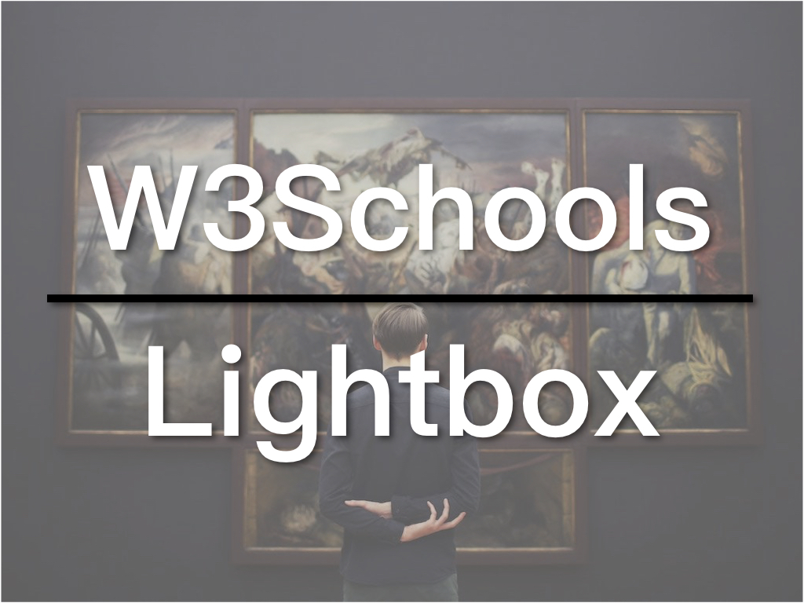

A Lightbox is a popup/modal window that shows an image or an image gallery. W3Schools offers two tutorials on this matter: Modal Images and Lightbox. The former shows one image and the latter shows a gallery, but the principle of the two is the same. In this article, we will use the Modal Images as an example, because it is easier to understand. If you can understand how the Modal Images work, you will have no problem figuring out how the lightbox works.

* [W3Schools Lightbox Tutorial](https://www.w3schools.com/howto/howto_css_modal_images.asp)
* [Lightbox Example](https://www.w3schools.com/howto/tryit.asp?filename=tryhow_js_topnav)

`youtube:https://www.youtube.com/embed/IpysIcMqrrQ`

## How to Create a Lightbox

How to create a lightbox:

1. Hide the lightbox by default.
2. Only show the lightbox when the thumbnail is clicked.
3. Use CSS animation to create the zoom in effect.

### The HTML of the lightbox

Here's the HTML of the lightbox:

```


<div id="myModal" class="modal">

  <span class="close">&times;</span>

  

  <div id="caption"></div>
</div>
```

The first image is the thumbnail with a maximum width of 300px. The lightbox comes next and is called myModal as it is also a modal. It consists a close button, an image, and a caption. Note that the src of the image is not specified. It will be added by JavaScript, so is the content of the caption. The light box was hidden at the beginning through CSS.

### The CSS of the Lightbox

And here is the CSS of the lightbox:

```
/* Style the Image Used to Trigger the Modal */
#myImg {
  border-radius: 5px;
  cursor: pointer;
  transition: 0.3s;
}

#myImg:hover {opacity: 0.7;}

/* The Modal (background) */
.modal {
  display: none; /* Hidden by default */
  position: fixed; /* Stay in place */
  z-index: 1; /* Sit on top */
  padding-top: 100px; /* Location of the box */
  left: 0;
  top: 0;
  width: 100%; /* Full width */
  height: 100%; /* Full height */
  overflow: auto; /* Enable scroll if needed */
  background-color: rgb(0,0,0); /* Fallback color */
  background-color: rgba(0,0,0,0.9); /* Black w/ opacity */
}

/* Modal Content (Image) */
.modal-content {
  margin: auto;
  display: block;
  width: 80%;
  max-width: 700px;
}

/* Caption of Modal Image (Image Text) - Same Width as the Image */
#caption {
  margin: auto;
  display: block;
  width: 80%;
  max-width: 700px;
  text-align: center;
  color: #ccc;
  padding: 10px 0;
  height: 150px;
}

/* Add Animation - Zoom in the Modal */
.modal-content, #caption {
  animation-name: zoom;
  animation-duration: 0.6s;
}

@keyframes zoom {
  from {transform:scale(0)}
  to {transform:scale(1)}
}

/* The Close Button */
.close {
  position: absolute;
  top: 15px;
  right: 35px;
  color: #f1f1f1;
  font-size: 40px;
  font-weight: bold;
  transition: 0.3s;
}

.close:hover,
.close:focus {
  color: #bbb;
  text-decoration: none;
  cursor: pointer;
}

/* 100% Image Width on Smaller Screens */
@media only screen and (max-width: 700px){
  .modal-content {
    width: 100%;
  }
}
```

The key is the `.modal`, which is not displayed at the beginning and takes up the whole screen. The background color is black with 0.9 opacity setting.

The zoom in effect is done in the CSS animation. We are using transform to scale the scale of the image and the caption from 0 to 1.

### The JavaScript of the Lightbox

Finally, let's take a look at the JavaScript:

```
// Get the modal
var modal = document.getElementById('myModal');

// Get the image and insert it inside the modal - use its "alt" text as a caption
var img = document.getElementById('myImg');
var modalImg = document.getElementById("img01");
var captionText = document.getElementById("caption");
img.onclick = function(){
  modal.style.display = "block";
  modalImg.src = this.src;
  captionText.innerHTML = this.alt;
}

// Get the <span> element that closes the modal
var span = document.getElementsByClassName("close")[0];

// When the user clicks on <span> (x), close the modal
span.onclick = function() {
  modal.style.display = "none";
}
```

Three things are done in the JavaScript here. Firstly, show the lightbox. Secondly, set the src of the image and use the alt from the thumbnail for the caption of the image. Lastly, implement the event function for the close button.

That's how you create a lightbox, if you want to know more, compare the tutorials of the modal images and the lightbox.

The code for the W3Schools series is available on GitHub: [W3Schools GitHub](https://github.com/ZacharyChim/W3Schools)

## W3Schools How-To Videos

W3Schools is a well-known web design/front-end development tutorial website, which not only provides detailed tutorials on HTML, CSS, JavaScript, etc., but also can be used as a reference, as it explains almost everything in the web design field. You probably have already visited this website as a frontend developer, because it often appears on the first page of many search results that are related to web design. And its How To section is really useful. It provides tutorials on, for example, how to make a SlideShow (picture carousel), a Lightbox, a Parallax effect and so on. So I want to do a series of videos dedicated to these How-Tos.

1. [Float Responsive Layout](https://atzack.com/w3schools-web-layout/)
2. [Flexbox Responsive Layout](https://atzack.com/w3schools-flex/)
3. [CSS Grid Responsive Layout](https://atzack.com/w3schools-grid/)
4. [How to Create a Slideshow](https://atzack.com/w3schools-slideshow/)
5. [How to Create a Responsive Navigation](https://atzack.com/w3schools-responsive-nav/)