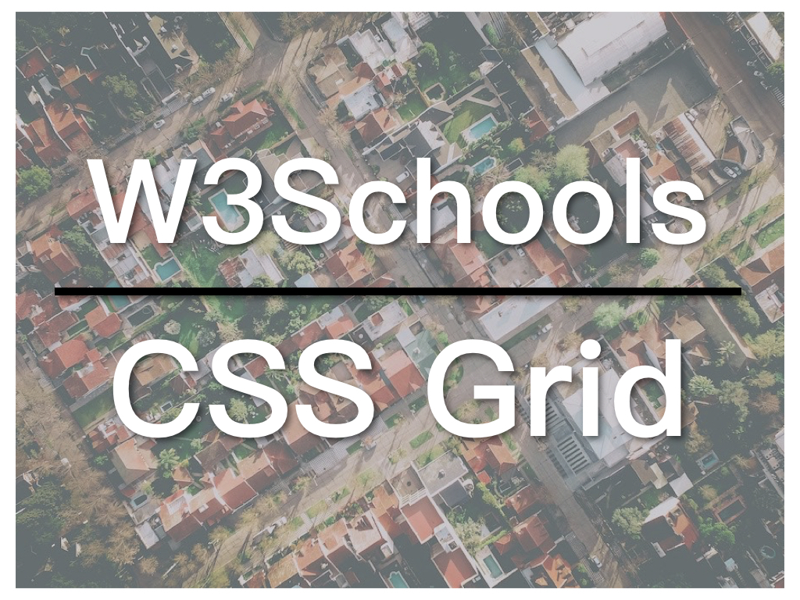

Today we are going to continue with [responsive Layout](https://zacklive.com/w3schools-web-layout/), using **CSS Grid**. CSS Grid is designed for grid layout, which is perfect for website layout. Currently all the mainstream browsers have already supported CSS Grid, unless you are sure that your users use older browsers, like IE 9, it is recommended to use CSS Grid to create layouts for websites. If you are not familiar with CSS Grid, you can refer to the tutorial on W3Schools:

* [W3Schools CSS Grid Teaching](https://www.w3schools.com/css/css_grid.asp)

* [CSS Grid responsive layout example](https://www.w3schools.com/css/tryit.asp?filename=trycss_grid_layout_named)

## Video link

## CSS Grid Responsive Layout

There are many ways to implement responsive layouts with CSS Grid. The easiest is to use *grid-template-areas* (note that it is plural). Again it takes three steps:

1. Assign a name of *grid-area* to each Grid item;
2. Use grid-template-areas to control the space occupied by each Grid item;
3. Change the space occupied by each Grid item with **Media Query**.

In the W3Schools example, each div is given a corresponding grid-area name:

```
.item1 { grid-area: header; }
.item2 { grid-area: menu; }
.item3 { grid-area: main; }
.item4 { grid-area: right; }
.item5 { grid-area: footer; }
```

Note that *grid-area* is singular. And then you can use grid-template-areas to control them.

```
.grid-container {
  display: grid;
  grid-template-areas:
    'header header header header header header'
    'menu main main main right right'
    'menu footer footer footer footer footer';
  grid-gap: 10px;
  background-color: #2196F3;
  padding: 10px;
}
```

The grid-template-areas is the key point here. You can see that the setting here is same as the final result. Where menu is the minimum width unit, the width of the header div equals to the width of six menus; the main div equals to three menus; the right div equals to two menus; and the footer div equals to five menus. The width of the menu is 1 unit, but it takes up two rows in height.

In this example, responsiveness was not considered, but we can do that just adding a small piece code of the media query.

```
@media screen and (max-width: 700px) {
  .grid-container {
    grid-template-areas:
        'header'
        'menu'
        'main'
        'right'
        'footer'
  }
}
```

In the media query, you can change the entire layout by changing the settings of grid-template-areas. This is the magic of CSS grid and why it is the best option for layout design.

Again, this example does not embrace the mobile first principle. You can apply the principle to the example as an exercise.

The code for changes is available on GitHub: [W3Schools GitHub](https://github.com/ZacharyChim/W3Schools)

## W3Schools How-To Videos

W3Schools is a well-known web design/front-end development tutorial website, which not only provides detailed tutorials on HTML, CSS, JavaScript, etc., but also can be used as a reference, as it explains almost everything in the web design field. You probably have already visited this website as a frontend developer, because it often appears on the first page of many search results that are related to web design. And its How To section is really useful. It provides tutorials on, for example, how to make a SlideShow (picture carousel), a Lightbox, a Parallax effect and so on. So I want to do a series of videos dedicated to these How-Tos.

1. [Float Responsive Layout](https://atzack.com/w3schools-web-layout/)
2. [Flexbox Responsive Layout](https://atzack.com/w3schools-flex-layout/)
3. [CSS Grid Responsive Layout](https://atzack.com/w3schools-grid/)