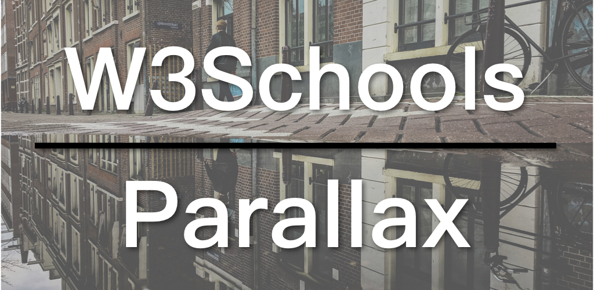

Parallax is a scrolling effect where the background content, usually an image, is moved slower than the foreground content or is not moved at all while scrolling. This effect was quite popular for a while, you can still find them on many websites that emphasize their design. It is easier than I thought to create such an effect and it's basically based on the `background-attachment` setting.

* [W3Schools Parallax](https://www.w3schools.com/howto/howto_css_parallax.asp)
* [Parallax Demo](https://www.w3schools.com/howto/tryhow_css_parallax_demo.htm)
* [background-attachment](https://www.w3schools.com/cssref/pr_background-attachment.asp)

## Video

## How to Create a Parallax Effect

How to create a parallax effect:

1. Use a container (div) for the background image.
2. Set the height of the container, which is also the height of the background image; If the container is taking the whole screen as its height (height: 100%), make sure that you set the height of the `body` and `html` to 100% too, otherwise, the background would be overlaid by the foreground content.
3. Set `background-attachment: fixed`, so that the background doesn't move while scrolling.

### The HTML of the parallax demo

Here's the HTML of the parallax demo:

```
<div class="parallax"></div>

<div style="height:1000px;background-color:blue;font-size:36px">
Scroll Up and Down this page to see the parallax scrolling effect.
This div is just here to enable scrolling.
Tip: Try to remove the background-attachment property to remove the scrolling effect.
</div>

<div class="parallax"></div>
```

The HTML part is quite simple, just a container for the background image and another container for the foreground content. The last container is the same as the first and can be omitted. It creates an effect of the background image "coming back".

### The CSS of the Parallax demo

And here is the CSS of the Parallax demo:

```
body, html {
  height: 100%;
}

.parallax {
  /* The image used */
  background-image: url('img_parallax.jpg');

  /* Full height */
  height: 100%;

  /* Create the parallax scrolling effect */
  background-attachment: fixed;
  background-position: center;
  background-repeat: no-repeat;
  background-size: cover;
}
```
In this demo, the background image is taking up the whole screen, therefore, the height of the `body` and `html` is also set to 100%. We assigned the background image to the parallax class in CSS. And finally, we set the `background-attachment` to fixed, so that the background does move while scrolling. And set the position of the background image to the center of the container, do not repeat it, and lastly let it cover the whole container.

That's how you create a parallax effect, you don't even need JavaScript. It's easy and looks pretty cool.

The code for the W3Schools series is available on GitHub: [W3Schools GitHub](https://github.com/ZacharyChim/W3Schools)

## W3Schools How-To Videos

W3Schools is a well-known web design/front-end development tutorial website, which not only provides detailed tutorials on HTML, CSS, JavaScript, etc., but also can be used as a reference, as it explains almost everything in the web design field. You probably have already visited this website as a frontend developer, because it often appears on the first page of many search results that are related to web design. And its How To section is really useful. It provides tutorials on, for example, how to make a SlideShow (picture carousel), a Lightbox, a Parallax effect and so on. So I want to do a series of videos dedicated to these How-Tos.

1. [Float Responsive Layout](https://atzack.com/w3schools-web-layout/)
2. [Flexbox Responsive Layout](https://atzack.com/w3schools-flex/)
3. [CSS Grid Responsive Layout](https://atzack.com/w3schools-grid/)
4. [How to Create a Slideshow](https://atzack.com/w3schools-slideshow/)
5. [How to Create a Responsive Navigation](https://atzack.com/w3schools-responsive-nav/)