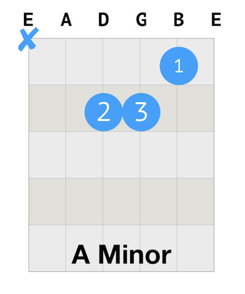
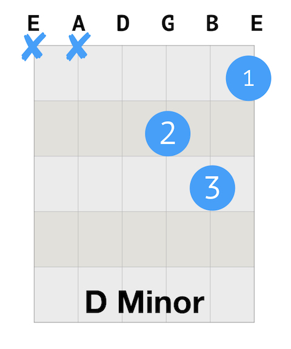
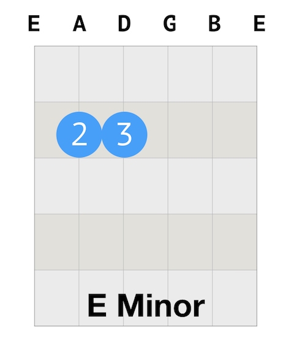

##Daily Guitar Practice 7 A Girl Like You

To get familiar with Am, Dm, and Em chords, I will start to practice the song: A Girl Like You by Edwyn Collins. Today's goal is to get familiar with the chord sequence and the new strumming pattern of the song.

1. Warm up
   * Finger stretch.
   * Walking the notes.
   * C Scale.
   * Happy Birthday
   * Sing a note.

2. Revision 1: A, D, E Chords
   * All down strumming & base - down up.

3. Revision 2: Am, Dm, Em chords.
   * New strumming pattern: Down - Down Up - Up Down -

4. New song: A Girl Like You by Edwyn Collins
   * Sequence: 
   Am Am Am Am 
   Dm Dm Em Em
   Am Am Am Am
   Dm Dm Am Am


Justin's tutorial of this song:

`youtube:https://www.youtube.com/embed/Hak_BtyuyZQ`

##How to play Happy Birthday
```
G G A G C B

G G A G D C

G G G*E C B A

F F E C D C
```

##How to play Am major chord

The number on the blue circle indicates the finger: 1: index finger; 2: middle finger; 3: ring finger; 4: pinky. And the blue X means you don't play that string(s).

Here is the guitar tab for A major chord. 



##How to play D major chord

Here is the guitar tab for D major chord.



##How to play E major chord

Here is the guitar tab for E major chord.



##Guitar Arsenal

This is a record of what I have learned.

###Chords

Major chords: A, D, E;

Minor chords: Am, Dm, Em;

###Strumming Patterns

1. Base - Down Up
2. Down - Down Up - Up Down -

###Songs

1. I Walk The Line by Johnny Cash (Simplified)
2. A Girl Like You by Edwyn Collins (Simplified) (Ongoing)